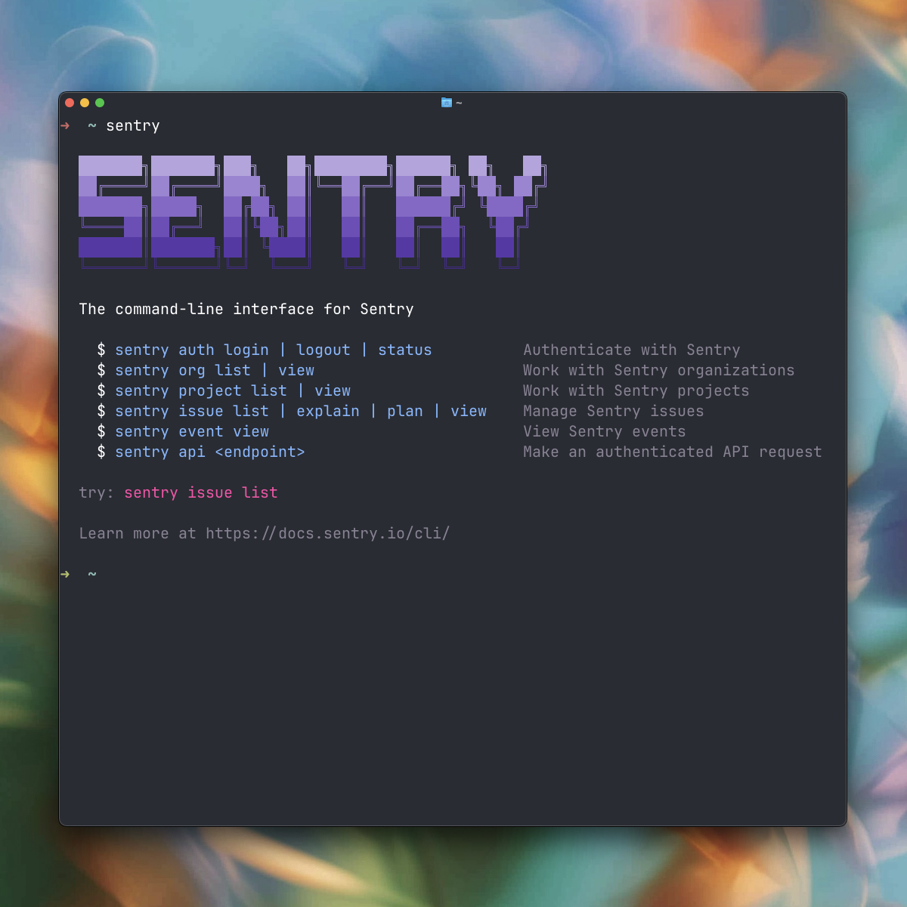

<p align="center">
  
</p>

<p align="center">
  The command-line interface for Sentry. Built for developers and AI agents.
</p>

<p align="center">
  <a href="https://cli.sentry.dev">Documentation</a> |
  <a href="https://cli.sentry.dev/getting-started/">Getting Started</a> |
  <a href="https://cli.sentry.dev/commands/">Commands</a>
</p>

---

## Installation

### Install Script (Recommended)

```bash
curl -fsSL https://cli.sentry.dev/install | bash
```

### Homebrew

```bash
brew install getsentry/tools/sentry
```

### Package Managers

```bash
npm install -g sentry
pnpm add -g sentry
bun add -g sentry
```

### Run Without Installing

```bash
npx sentry@latest
```

## Quick Start

```bash
# Authenticate with Sentry
sentry auth login

# List issues (auto-detects project from your codebase)
sentry issue list

# Get AI-powered root cause analysis
sentry issue explain PROJ-ABC

# Generate a fix plan
sentry issue plan PROJ-ABC
```

## Features

- **DSN Auto-Detection** - Automatically detects your project from `.env` files or source code. No flags needed.
- **Seer AI Integration** - Get root cause analysis and fix plans directly in your terminal.
- **Monorepo Support** - Works with multiple projects, generates short aliases for easy navigation.
- **JSON Output** - All commands support `--json` for scripting and pipelines.
- **Open in Browser** - Use `-w` flag to open any resource in your browser.

## Commands

| Command | Description |
|---------|-------------|
| `sentry auth` | Login, logout, check authentication status |
| `sentry org` | List and view organizations |
| `sentry project` | List and view projects |
| `sentry issue` | List, view, explain, and plan issues |
| `sentry event` | View event details |
| `sentry api` | Make direct API requests |

For detailed documentation, visit [cli.sentry.dev](https://cli.sentry.dev).

## Configuration

Credentials are stored in `~/.sentry/` with restricted permissions (mode 600).

---

## Development

### Prerequisites

- [Bun](https://bun.sh) v1.0+

### Setup

```bash
git clone https://github.com/getsentry/cli.git
cd cli
bun install
```

### Running Locally

```bash
# Run CLI in development mode
bun run dev --help

# With environment variables
bun run --env-file=.env.local src/bin.ts --help
```

### Scripts

```bash
bun run build        # Build for current platform
bun run typecheck    # Type checking
bun run lint         # Check for issues
bun run lint:fix     # Auto-fix issues
bun test             # Run tests
```

See [DEVELOPMENT.md](DEVELOPMENT.md) for detailed setup and [CONTRIBUTING.md](CONTRIBUTING.md) for contribution guidelines.

## License

[FSL-1.1-Apache-2.0](LICENSE.md)
